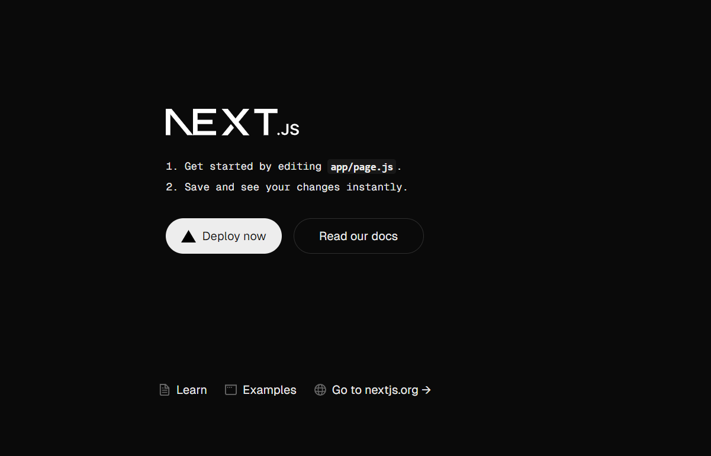

# Next.JS

- ## In this repository I'll be sharing all my Next.JS learning.

- Next.JS is a framework for building React Applications.

- To build make Big Applications Next.js is a suitable choice.

- We don't need anymore use of react file routing, it can handle automatically.

- It has SEO tools as well as different ways of rendering data.

- It provides API routes, so that we can have back-end and front-end code in the same project.

- We can see additonal features like router from next/navigation

- We also see the optimized rendering.

## Why did Next.js Introduce App Router?

- The App Router is a new routing system introduced in Next.js 13. It replaces the previous file-based routing system and introduces several new features and improvements. Here are some of the key reasons why Next.js introduced the App Router.

- The App Router (in app/) was introduced in Next.js 13+ to improve flexibility, reusability, and performance.

- It allows for more dynamic routing, nested layouts, and server actions.

- It also provides better SEO support and improved developer experience.

### Quick Comparison

| Feature                        | **Pages-Based (`pages/`)** | **App-Based (`app/`)**  |
| ------------------------------ | -------------------------- | ----------------------- |
| **Introduced In**               | Before Next.js 13           | Next.js 13+              |
| **Routing Style**               | File = Route                | Folder + File = Route    |
| **Dynamic Routes**              | `[param].js`                | `[param]/page.js`        |
| **Layouts**                     | `_app.js` (global only)     | `layout.js` (nested layouts) |
| **Data Fetching**               | `getServerSideProps`        | Server components (async) |
| **Server Components**           | No                          | Yes                      |
| **Customizable Loading States** | No                          | `loading.js` support     |
| **SEO Optimizations**           | Manual                      | Automatic with `head.js` |

---

