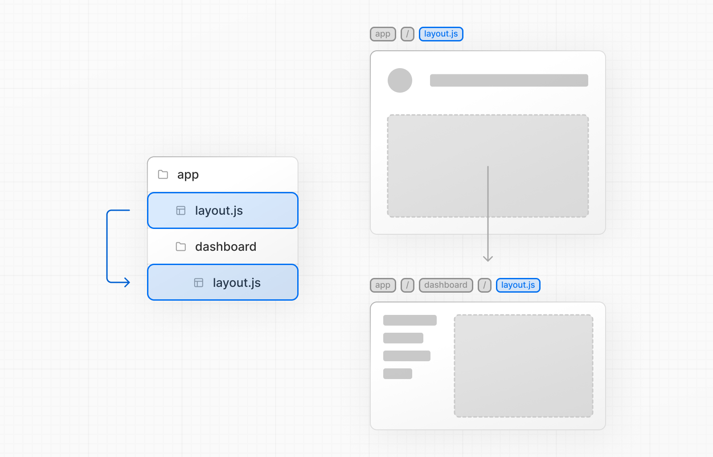
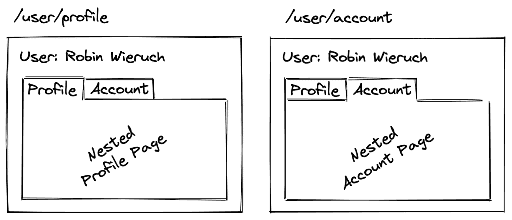

# 📚 What are Layouts?

- **Layouts** in Next.js provide a way to share common UI across multiple pages, such as navigation bars, footers, or a global state wrapper like a session provider. **With the App Router, layouts are powerful and hierarchica.** 

- In simple words, Think of layouts like frames around your pictures. They're the parts of your website that stay the same when different pages load - like headers, footers, and navigation bars.



### Key Concepts of Layouts

1. **Hierarchy:** Layouts can be nested, allowing for specific layouts for different parts of the app.

2. **Server-rendered by default:** Layouts run on the server unless explicitly marked as client components.

3. **Persistent UI:** Layouts persist across route changes, enabling smooth transitions.

## Example Folder Structure :
```
LAYOUT-NEXT/
├── app/
│   ├── (admin)/          # Admin-specific routes
│   │   ├── comments/
│   │   │   └── page.js
│   │   ├── login/
│   │   │   └── page.js
│   │   ├── logout/
│   │       ├── layout.js # Admin-specific layout
│   │       └── page.js
│   ├── about/
│   │   └── page.js       # About page
│   ├── components/       # Shared components
│   │   ├── Footer.js
│   │   └── Navbar.js
│   ├── globals.css       # Global styles
│   ├── layout.js         # Root layout (applies to all pages)
│   └── page.js           # Home page
├── public/
│   └── favicon.ico
├── .gitignore
├── next.config.mjs
├── package.json
├── README.md

```

## Root Layout ( `app/layout.js`)
- This is the global layout applied across the entire application. It includes a shared Navbar and Footer for consistent design.

## How Layouts work.

- **Metadata:** Defines the title and description for SEO purposes.
- **{children}:** Represents the content of child pages.

- **Root layout** (Must Have!)
```javascript
export default function RootLayout({ children }) {
  return (
    <html>
      <body>
        <nav>Common Navigation</nav>
        {children}
        <footer>Common Footer</footer>
      </body>
    </html>
  );
}
```
## Nested layouts

- Each route or sub-route can have its own layout.

File: `app/(admin)/layout.js`

``` graph TD
    A[Root Layout] --> B[Admin Layout]
    B --> C[Login Page]
    B --> D[Comments Page] 
```
### How it works - 

- The `(admin)` wraps all the pages inside it, and it has it's own `layout.js` where we can include all the different routes.

## Admin Layout (`app/(admin)/logout/layout.js`)
- This layout is specific to the Admin section. Any pages within the (admin) folder will use this layout.

### Code : 

```javascript
export default function adminLayout({ children }) {
    return (
        <>
        <span>Admin Navbar</span>
        { children }
        </>
    );
}
```

## 🔑 Key points

1. **Root Layout is Required**

- Must have html and body tags
- Applies to all pages
Nested Layouts

2. **Nested Layouts** 

- Create specific layouts for different sections.
- Pages inside share the same UI elements
Layout Persistence

3. **Layouts maintain state**
- Components don't re-render when changing pages

### Benefits

- Less code Repetition
- Better Performance.
- Consistent User interface
- Easier Maintainance.

### Best Practices 

1. Keep layouts simple
2. Use commone components
3. Don't put too much logic in layouts.
4. Create specific layouts for different sections.


## Remember
- Layouts wrap around pages
- Root layout is like your website's frame.
- Nested layouts add more frames inside
- Components can be shared across layouts.

### **Need more help** - [Layouts and pages in nextjs](https://nextjs.org/docs/app/getting-started/layouts-and-pages)