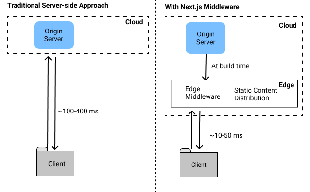

# Middleware in Next.js 

- Middleware in Next.js allows you to run code before a request is completed. 

- It helps to modify the request, changing the request, like before reaching the destination we can change the data in the middle, allowing you to modify, redirect or enhance the request data as needed.

- This can be useful for tasks such as authentication, logging, or document preparation. 

- Below is an example of how to create middleware for document preparation in a Next.js application.

<br/>



## Setting up middleware

- To add middleware in a Nex.js app:

1. Create a `middleware.js` file in the root directory of your project.

2. Export a default function from this file.

- The middleware function receives a  `request` object and can return a `NextResponse` or perform actions such as redirection  or modification of headers.

---

### Short Note:

-  **Redirect**: Changes the URL in the browser and sends the user to a new location.  
- **Rewrite**: Keeps the original URL in the browser but serves content from a different destination.

### Example- 

- You want to use wikipedia's data on your website.

- If you use **redirect**, the user will be sent to Wikipedia, and their browser's URL will change to Wikipedia's URL.  

- If you use **rewrite**, the user stays on your website, but the content is fetched and displayed as if it’s from your site, without revealing the Wikipedia URL.

--- 

- So basically we get the request and object access and we can do anything with the request and object.

## Setting Headers - 

- We can set request and response headers using `NextResponse` API (setting request headers is available since Next.js v13.00)

```javascript
import { NextResponse } from 'next/server'
 
export function middleware(request) {
  // Clone the request headers and set a new header `x-hello-from-middleware1`
  const requestHeaders = new Headers(request.headers)
  requestHeaders.set('x-hello-from-middleware1', 'hello')
 
  // You can also set request headers in NextResponse.next
  const response = NextResponse.next({
    request: {
      // New request headers
      headers: requestHeaders,
    },
  })
 
  // Set a new response header `x-hello-from-middleware2`
  response.headers.set('x-hello-from-middleware2', 'hello')
  return response
} 
```

## Middleware Configuration

- If you want middleware to run only on specific routes, you can configure it using the `matcher` property.

### Example - 

```javascript
export const config = {
  matcher: ['/about/:path*', '/dashboard/:path*'], // Apply middleware to specific routes
};
```

### Code Example - 

1. Middleware Logic - 

- Redirect users from `/dashboard` to `/about.js`.

- Rewrite `/about` to serve content from the root route(`/`).

```javascript
import { NextResponse } from 'next/server';

export function middleware(request) {
  if (request.nextUrl.pathname.startsWith('/about')) {
    return NextResponse.rewrite(new URL('/', request.url));
  }

  if (request.nextUrl.pathname.startsWith('/dashboard')) {
    return NextResponse.redirect(new URL('/about.js', request.url));
  }

  return NextResponse.next();
}

```

- when a user accesses `/dashboard` they are redirectd to `/about.js`

### Summary 

- Middleware is a powerful feature in Next.js that allows you to:

1. Intercept and process requests before they reach the destination.

2. Modify, rewrite, or redirect requests dynamically.

3. Enhance user experience with advanced routing and content serving.

This enables you to add authentication, customize headers, or prepare responses dynamically without affecting the client-side logic.